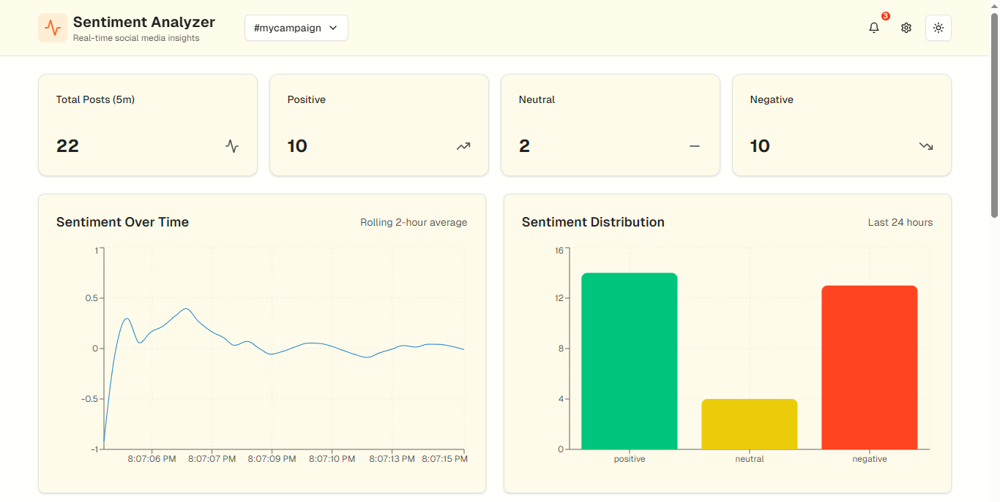
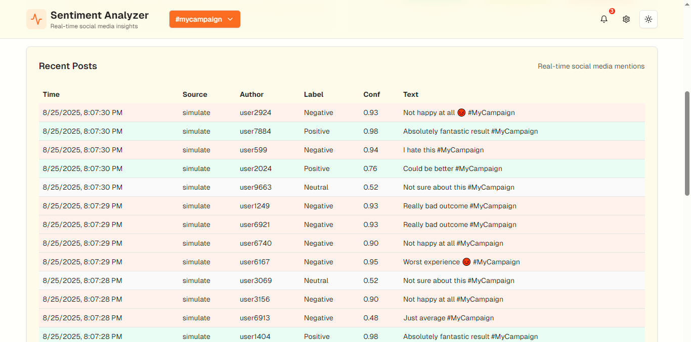

# 📌 Social Media Sentiment Analyzer (FastAPI + Next.js)

A full-stack project that **streams social posts for a campaign hashtag**, runs **transformer-based sentiment analysis**, and provides an interactive **Next.js dashboard** for real-time visualization.

---

## 🔑 Features
- **AI/NLP**: Hugging Face `transformers` pipeline (default: `cardiffnlp/twitter-roberta-base-sentiment-latest`)  
- **Backend**: FastAPI for REST APIs + real-time streaming  
- **Frontend**: Next.js + Tailwind + shadcn/ui (modern dashboard with charts & tables)  
- **Streaming**:  
  - Default: **Simulated stream** (no API keys needed)  
  - Optional: Twitter/X **Filtered Stream** if `TWITTER_BEARER_TOKEN` is set in `.env`  

---

## 🚀 Getting Started

### 1️⃣ Clone the repo
```bash
git clone https://github.com/<your-username>/sentiment_analyzer.git
cd sentiment_analyzer
```

### 2️⃣ Setup backend (FastAPI)
```bash
# Create and activate virtualenv (Windows PowerShell shown)
python -m venv .venv
.venv\Scripts\Activate.ps1

# Install dependencies
pip install -r requirements.txt

# Copy env file
copy .env.example .env   # Windows
# or: cp .env.example .env   # macOS/Linux

# Run FastAPI backend
uvicorn api_main:app --reload --port 8000
```

Backend should now be running at 👉 [http://localhost:8000](http://localhost:8000)

---

### 3️⃣ Setup frontend (Next.js)
```bash
cd frontend

# Install dependencies
npm install   # or pnpm install

# Start Next.js dev server
npm run dev
```

Frontend should now be available at 👉 [http://localhost:3000](http://localhost:3000)

---

## 📊 Dashboard Features
✅ **Dashboard Overview** → Sentiment stats (positive, neutral, negative)  
📈 **Line & Bar Charts** → Sentiment trends over time  
📋 **Data Table** → Live posts with their sentiment  
🌙 **Dark/Light Mode Toggle**  

---

## 📸 Screenshots  

### Dashboard Overview  
  

### Sentiment Trends  
  

*(Save your screenshots in `frontend/public/screenshots/` for them to appear here on GitHub.)*

---

## 🛠 Tech Stack
- **Backend**: FastAPI, Python, Hugging Face Transformers  
- **Frontend**: Next.js, React, Tailwind CSS, shadcn/ui, Recharts  
- **Streaming**: Simulated / Twitter API  

---

## 🤝 Contributing
Pull requests are welcome. For major changes, please open an issue first to discuss what you’d like to change.  
